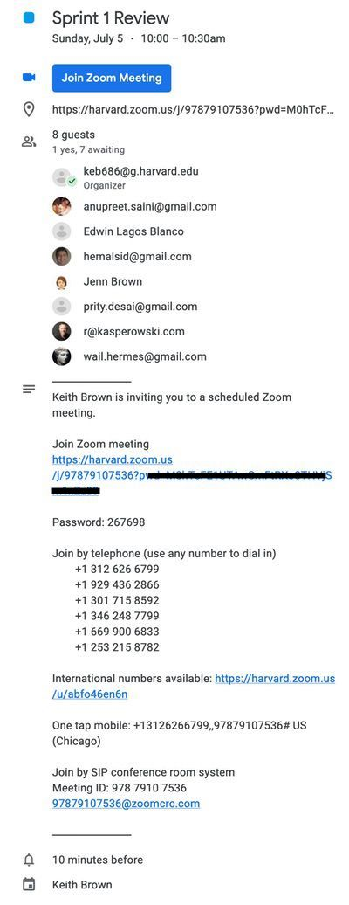
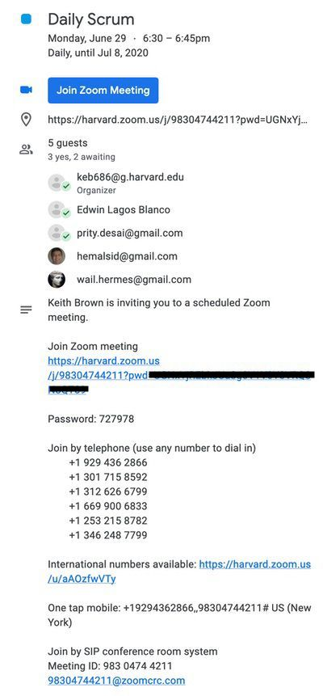
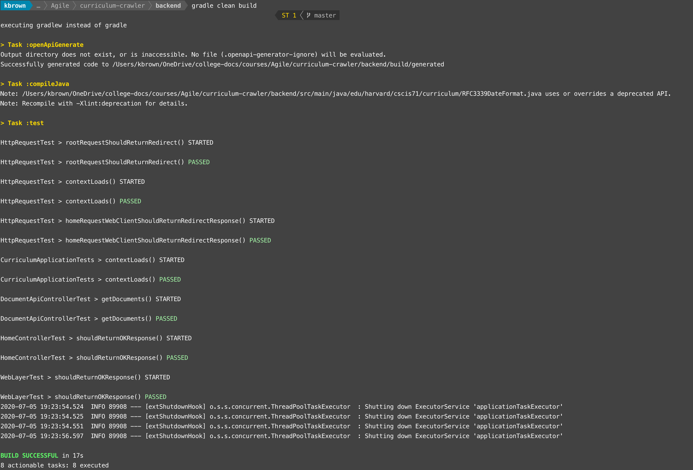
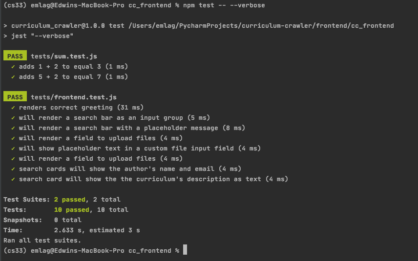
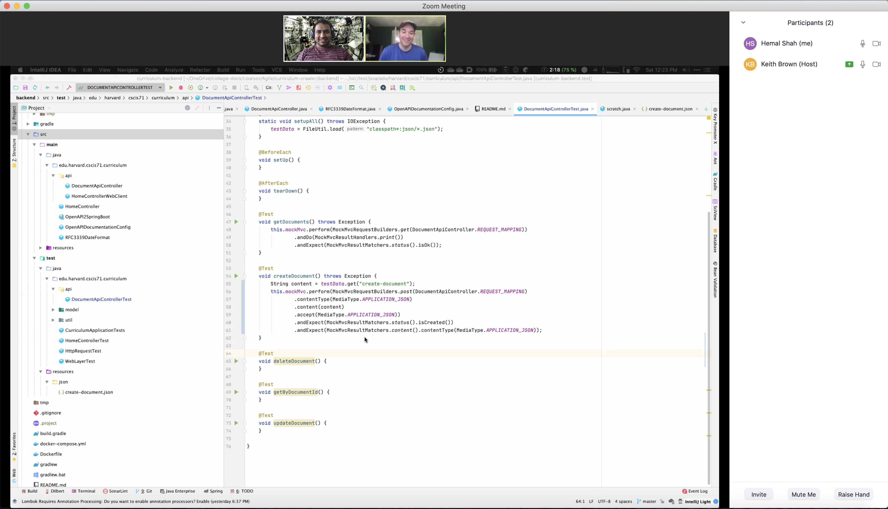
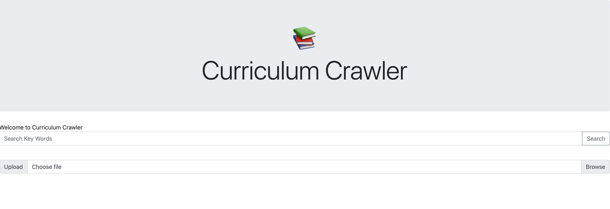
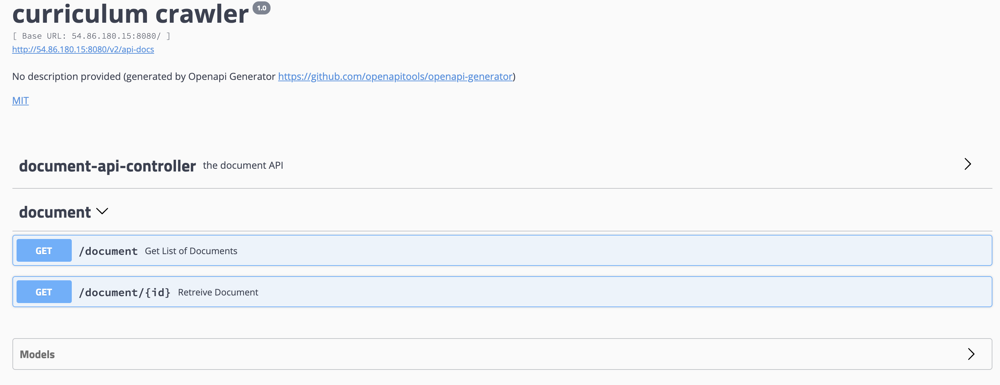
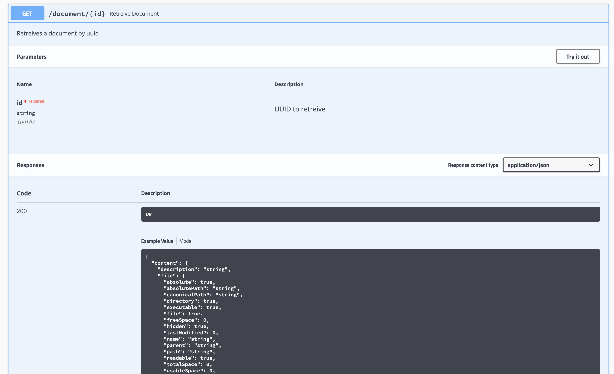

- [Curriculum Crawler](#curriculum-crawler)
- [Project Information](#project-information)
  - [Scrum Team](#scrum-team)
  - [Stakeholders](#stakeholders)
  - [Stakeholder Persona](#stakeholder-persona)
    - [Jennifer Brown](#jennifer-brown)
  - [Product Iteration (Summer 2020)](#product-iteration-summer-2020)
  - [Product Backlog](#product-backlog)
    - [Rationale for Backlog Order](#rationale-for-backlog-order)
  - [Definition of Ready](#definition-of-ready)
  - [Definition of Done](#definition-of-done)
  - [Initial Estimation](#initial-estimation)
- [Sprint 1](#sprint-1)
  - [Sprint 1 Forecast](#sprint-1-forecast)
  - [Sprint Forecast Rationale](#sprint-forecast-rationale)
  - [Sprint 1 Backlog](#sprint-1-backlog)
  - [Sprint 1 Backlog screenshot](#sprint-1-backlog-screenshot)
  - [Sprint 1 Story sizes](#sprint-1-story-sizes)
  - [Burndown Chart](#burndown-chart)
  - [Daily Scrums](#daily-scrums)
    - [Friday July 3, 2020](#friday-july-3-2020)
  - [Impediment removal plan](#impediment-removal-plan)
- [Test Driven Development](#test-driven-development)
  - [Unit Tests](#unit-tests)
  - [Unit Test Run](#unit-test-run)
    - [Backend Unit Tests](#backend-unit-tests)
    - [Front End Unit Tests](#front-end-unit-tests)
    - [Peer Programming](#peer-programming) 
  - [Sprint 1 review](#sprint-1-review)
    - [Sprint Demo](#sprint-demo)
      - [Frontend Demo](#frontend-demo)
      - [Backend Demo](#backend-demo)
  - [Sprint 1 Retrospective](#sprint-1-retrospective)
- [More Info](#more-info)

# Curriculum Crawler

# Project Information
## Scrum Team
- Scrum Master / Developer (Back End) / DevOps: Prity Hutchinson
- Product Owner / Developer (Front End): Edwin Lagos
- Developer (Back end) / Meeting Facilitator / DevOps: Keith Brown
- Developer (Back end) : Hemal Shah
- Developer (Front End) / UX Designer: Wa'il Choudar

## Stakeholders
* __Teachers:__ Teachers face competing priorities and time management to cover all relevant curriculum within a school year.
* __Dean of curriculum:__ Reducing overlapping topics through multiple curriculums can help optimize teachers' time, and add value to students' learning calendar.
* __Principal:__ All of the above allows Principals to strategize staffing and allow parents to follow clear learning projections.
* __Students:__ Students gain knowledge in order of learning, which keeps prequisites in check through cross curriculums, without wasting time on duplicated topics through multiple classes
* __Parents:__ Parents can feel confident knowing that the children have organized education levels of learning.

## Stakeholder Persona
### Jennifer Brown

* _Age:_ 43
* _Gender:_ female
* _Location:_ Dedham, Massachusetts 
* _Technical Comfort:_ Advanced
* _Job Title:_ AP Biology Teacher

__Backstory:__ Jennifer is married to Keith Brown. She is the Department Chair of the Science Department and teaches Biology and AP Biology. Jennifer has a post-graduate degree in education, working with curriculum design. She leads the redesign of the Seventh and Eighth-grade Science curriculum as an ongoing project at the school. Her job requires her to work closely with the Dean of Curriculum and coordinate with other departments at the school

__Motivations:__ She would have found the service by a search after working with competing products that don't deliver features she requires. Additionally, alternative products would are cost-prohibitive to use.    

__Goals:__ A prime requirement for her is cross-discipline alignment. Cross-discipline alignment is essential so that there is an understanding of what topics the other departments teach. She would recommend our service to all the departments at her school, leading to the school maximizing coordination amongst the departments.

__Barriers:__ A significant barrier will be importing data, having to copy/paste from one application to another can become tedious and lead to rage-quit. 

__Quote:__ "That will work" or "That works." or "That doesn't suck."

## Product Iteration (Summer 2020)
* __Name:__ Curriculum Crawler
* __Product Iteration Far Vision:__ Empowering Interdisciplinary Learning. 
* __Product Iteration Near Vision:__ The Curriculum Crawler is a search engine for teachers and curriculum coordinators that empowers interdisciplinary learning.
Unlike Managebac and Canvas, our product will find connections between subject’s written curriculum and connect teachers to allow them to collaborate. 
* __Key Architecture:__ 
  * Infrastructure: 
    * Heroku AWS 
    * EC2
  * Persistence:
    * Elasticsearch

## Product Backlog
Curriculum Crawler current product backlog is available to our Scrum Team members and management at [Trello](https://trello.com/b/iLxDKgHT/agile-sprint-board).
The user stories are found in the description of each Trello backlog item. 
### Rationale for Backlog Order
The product backlog is ordered with items critical for starting development on top. They are listed in descending priority on Trello.  

## Definition of Ready
  * Every Backlog Item has a title
  * Every Backlog Item has a opening sentence
  * Every Backlog Item has been Estimated in story points
  * All external dependencies have been resolved, whether the dependency was on another team or on an outside vendor.

## Definition of Done
  * Tests passed
  * Code reviewed
  * Acceptance criteria met
  
## Initial Estimation
  The team performed a Poker Point Activity on June 30, 2020. Only the development team members participated in the Poker Point Activity. Prity and Edwin participated as development team members while participating in point estimation while offering Scrum Master and Product Owner duties during Estimation. On each item in the backlog there is an Estimation field with the story points associated.
  
# Sprint 1
The Sprint Kanban board is at https://trello.com/b/iLxDKgHT/curriculum-crawler



## Sprint 1 Forecast 
- Sprint 1 forecast was determined to be 11 points.

## Sprint Forecast Rationale 
- Ideally, we would have previous sprints with achievable points in a sprint to forecast appropriately.
- Team 1 identified the set of MVP functionality that can be completed in the 4 day sprint through this accelerated 3 week class. Keeping Sprint goal in mind, Team 1 described “what” and “how” of the sprint and its user stories. With that information, development team was able to forecast 11 points.

## Sprint 1 Backlog
- Three key tasks to provide search functionality were identified as MVP for Sprint 1. The tasks include Start page for stakeholder to log in, upload documents for management and review, and search functionality to identify overlaps of curriculum for teachers to optimize time. 
- The aggregate size of stories is 11 points, same as a the forecast.
- Our front-end developer had an unfortunate accident with bone fractures and another back-end developer had a conflict. For that reason, Edwin (PO) and Prity (SM) played development roles and sized the stories.

## Sprint 1 Backlog screenshot
https://github.com/curriculum-crawler/curriculum-crawler/images/Sprint_1_backlog.png

## Sprint 1 Story sizes
- The 3 stories in Sprint 1 are sized: 1, 5 and 5 points respectively. They are less than half of our forecast velocity of 11 points. As on Trello Board - https://trello.com/b/iLxDKgHT/curriculum-crawler 

## Burndown Chart

## Daily Scrums



### Friday July 3, 2020
- Keith Brown
    - In the last 24 hours I
        - Completed the base implementation for receiving REST calls
        - Started implemention of the Upload Document API
    - In the next 24 hours I
        - Complete the Upload Document API
    - Do I have any impediments
        - I do not have any impediments.
- Prity Hutchinson
    - In the last 24 hours I
      - Created Powerpoint for Sprint Review, shared with PO to present.
      - Facilitated daily scrum meeting and evaluated spring backlog.
    - In the next 24 hours I
      - Facilitate Sprint Review meeting
      - Facilitate Sprint Retrospective meeting
      - Faciliate Sprint 2 planning
    - Do I have any impediments
      - Based on Professor Kasperowski's feedback, I've requested a timeslot for the team to review user stories but have not heard back. This guidance will be critical for Team 1 to submit Part 2 of the project, with the validation that documentation of user stories/tasks meet his expectations.
- Edwin Lagos
    - In the last 24 hours I
        - Completed the base implementation of the UI for the searching functionality.
        - Completed the creation of the UI for the search results UI.
        - Completed the tests for the UI components. 
    - In the next 24 hours I
        - Will finish documentation for the UI. 
        - Implement the upload API within the UI, if available. 
    - Do I have any impediments
        - I don't have any impediments. 
- Hemal Shah
    - In the last 24 hours I
      - created and configured the AWS account for backend deployment
      - Created a server to host the backend code. 
    - In the next 24 hours I
      - Setup the backed code to run on the server
    - Do I have any impediments
      - I don't have any impediments
- Wa'il Choudar
    - In the last 24 hours I
      - Created a Burndown Chart.
      - Revised the Kanban board. 
    - In the next 24 hours I
      - Pair program with Edwin Lagos.
      - Improve the UI design of the website.
    - Do I have any impediments
      - I don't have any impediments

## Impediment removal plan 
- Meeting scheduled for 11am July 5th with Professor to resolve impediments.

# Test Driven Development
- All Backend Server tests are executed on every checkin to Master at https://github.com/curriculum-crawler/curriculum-crawler/actions (Java CI with Gradle) 
- To view the tests executions 
    1. Select the "Java CI with Gradle" workflow
    2. Select a commit
    3. Select the "build" which will populate a tree structure in the center of the page
    4. Expand the "Build with Gradle" to view the Gradle build log which will display the Unit Tests output (output will be similar as displayed below in the [Unit Test Run](#unit-test-run) Section)
- The API Backend Server was build using a TDD Stragegy. 
-- Created first were the for the initial infrastructure work to prove the Server was working.
-- The second set of tests were the Upload Document tests.

## Unit Tests
Test Class | Behavior Tested
---------- | ---------------
[edu.harvard.cscis71.curriculum.CurriculumApplicationTests.java](backend/src/test/java/edu/harvard/cscis71/curriculum/CurriculumApplicationTests.java) | Initial test to validate that the spring contexts load
[edu.harvard.cscis71.curriculum.HomeControllerTest.java](backend/src/test/java/edu/harvard/cscis71/curriculum/HomeControllerTest.java) | Unit test without starting server to validate Root Endpoint
[edu.harvard.cscis71.curriculum.HttpRequestTest.java](backend/src/test/java/edu/harvard/cscis71/curriculum//HttpRequestTest.java) | Unit test starting server asserting the behavior or the application
[edu.harvard.cscis71.curriculum.WebLayerTest.java](backend/src/test/java/edu/harvard/cscis71/curriculum/WebLayerTest.java) | Unit test starting server asserting the behavior or the application
[edu.harvard.cscis71.curriculum.api.DocumentApiControllerTest.java](backend/src/test/java/edu/harvard/cscis71/curriculum/api/DocumentApiControllerTest.java) | Unit test testing document endpint
[sum.test.js](https://github.com/curriculum-crawler/cc_frontend/blob/master/tests/sum.test.js) | Initial validation that testing suite is able to find components. 
[frontend.test.js](https://github.com/curriculum-crawler/cc_frontend/blob/master/tests/frontend.test.js) | Unit tests that validate the correct rendering of React components for the UI


## Unit Test Run
### Backend Unit Tests
```bash
$> gradle clean build 
> Task :compileJava
Note: /Users/kbrown/OneDrive/college-docs/courses/Agile/curriculum-crawler/backend/src/main/java/edu/harvard/cscis71/curriculum/RFC3339DateFormat.java uses or overrides a deprecated API.
Note: Recompile with -Xlint:deprecation for details.

> Task :test

HttpRequestTest > rootRequestShouldReturnRedirect() STARTED

HttpRequestTest > rootRequestShouldReturnRedirect() PASSED

HttpRequestTest > contextLoads() STARTED

HttpRequestTest > contextLoads() PASSED

HttpRequestTest > homeRequestWebClientShouldReturnRedirectResponse() STARTED

HttpRequestTest > homeRequestWebClientShouldReturnRedirectResponse() PASSED

CurriculumApplicationTests > contextLoads() STARTED

CurriculumApplicationTests > contextLoads() PASSED

DocumentApiControllerTest > getDocuments() STARTED

DocumentApiControllerTest > getDocuments() PASSED

HomeControllerTest > shouldReturnOKResponse() STARTED

HomeControllerTest > shouldReturnOKResponse() PASSED

WebLayerTest > shouldReturnOKResponse() STARTED

WebLayerTest > shouldReturnOKResponse() PASSED
2020-07-05 19:15:18.044  INFO 82168 --- [extShutdownHook] o.s.s.concurrent.ThreadPoolTaskExecutor  : Shutting down ExecutorService 'applicationTaskExecutor'
2020-07-05 19:15:18.045  INFO 82168 --- [extShutdownHook] o.s.s.concurrent.ThreadPoolTaskExecutor  : Shutting down ExecutorService 'applicationTaskExecutor'
2020-07-05 19:15:18.075  INFO 82168 --- [extShutdownHook] o.s.s.concurrent.ThreadPoolTaskExecutor  : Shutting down ExecutorService 'applicationTaskExecutor'
2020-07-05 19:15:20.109  INFO 82168 --- [extShutdownHook] o.s.s.concurrent.ThreadPoolTaskExecutor  : Shutting down ExecutorService 'applicationTaskExecutor'

BUILD SUCCESSFUL in 21s
8 actionable tasks: 8 executed
```


### Front End Unit Tests
```bash
jest "--verbose"

 PASS  tests/sum.test.js
  ✓ adds 1 + 2 to equal 3 (2 ms)
  ✓ adds 5 + 2 to equal 7

 PASS  tests/frontend.test.js
  ✓ renders correct greeting (29 ms)
  ✓ will render a search bar as an input group (5 ms)
  ✓ will render a search bar with a placeholder message (5 ms)
  ✓ will render a field to upload files (4 ms)
  ✓ will show placeholder text in a custom file input field (3 ms)
  ✓ will render a field to upload files (4 ms)
  ✓ search cards will show the author's name and email (3 ms)
  ✓ search card will show the the curriculum's description as text (5 ms)

Test Suites: 2 passed, 2 total
Tests:       10 passed, 10 total
Snapshots:   0 total
Time:        1.873 s, estimated 2 s
Ran all test suites.
```



### Peer programming
- Backend was completed by Hemal and Keith following the peer programming principles. 


## Sprint 1 review
- Review was held on 5th July 2020 with Professor Richard
- https://github.com/curriculum-crawler/curriculum-crawler/images/Sprint_1_review_with_Richard_screenshot.png

### Sprint Demo
- The product was demonstrated to the client. The product in its current state can be found at https://curriculumcrawler.herokuapp.com/

#### Frontend Demo



#### Backend Demo




## Sprint 1 Retrospective

What worked well?
- The team met consistently on time for Scrum meetings
- The daily scrums were very helpful to remain aligned within team members, consistent with Agile principles and outcomes.
- Asked questions to clarify actions and keep accountability
- Team communicated well on Slack and in meetings
- Team members had a voice
- Well coordinated activities to develop software product	
- Good peer programming effort
- Back end and Front end development aligned well to develop product.
- Team was able to plan and deliver vertical thin slice of functional product.

What could be improved?
- The team took on more story points than able to complete in a 4 day sprint 1. This was due to it being the team's first sprint together, without a track record of throughput.

What will we commit to improving in the next Sprint?
- Team will have Sprint 1 to use as experience to reflect on Sprint 2's planning.

# More Info

We can also be found in Canvas [Project Group 1](https://canvas.harvard.edu/courses/72401/groups) and on our [Slack](https://agilesoftwarecourse.slack.com/archives/C015ND86AJ3) channel. Our Kanban board can be found at [Trello](https://trello.com/b/iLxDKgHT/agile-sprint-board).

***This is a final project for [Agile Software Development CSCI-E71](http://agilesoftwarecourse.org/) as part of degree requirements for  [Harvard Extension School](http://www.extension.harvard.edu/).***

***Built with love in Orlando, Hong Kong, Boston Area...***
